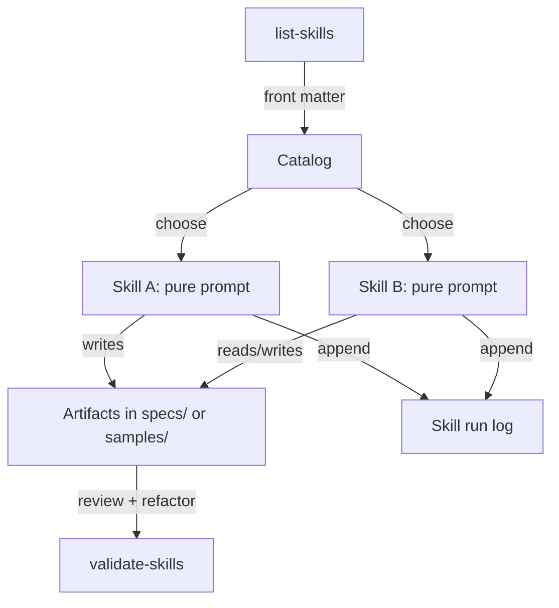

# Functional Skill Architecture

This guide explains how to design and operate the Claude Skills catalog using a functional-programming mindset. Treat each skill as a pure, composable function with explicit inputs and outputs so local IDE agents and cloud agents can orchestrate them predictably.

## Principles
- **Pure inputs/outputs:** Skills declare variables up front and write results to deterministic artifact paths (specs, samples, or runbooks). Avoid implicit context.
- **Composition over mutation:** Chain skills by feeding one skill's outputs (files, SDD sections, tables) as inputs to the next. Prefer small, single-purpose skills.
- **Idempotence:** Re-running a skill should converge on the same artifact. Store timestamps in logs (not in primary deliverables) to preserve diffable outputs.
- **Progressive disclosure:** Enumerate skills with `scripts/list-skills` and load bodies lazily (Codex/IDE agents should read SKILL.md only when relevant).
- **Cross-agent portability:** Keep skill contracts tool-agnostic. When integrating APIs, MCP servers, or scripts, specify them in **Toolchain & Integrations** and ensure fallbacks exist.

## Skill signature
- **Type-level front matter:** Treat `variables.required` and `variables.optional` as the function parameters and `outputs` as the return contract. If the folder path is `phase/role/action`, the `name` must equal `phase.role.action`.
- **Pre-/post-conditions:** Encode guards in the **Pre-run Checklist**; express invariants in **Implementation Notes** so they are reviewable like function docstrings.
- **Side-effect boundaries:** All writes go to one of: `specs/projects/<initiative>/...`, `samples/<project>/...`, or `run/` deliverables. Anything else belongs in a separate helper script referenced from **Toolchain & Integrations**.

## Composition patterns
- **Kleisli-style chaining:** Capture outputs (files, tables) from one skill and pass the paths into the next skill's variables rather than mutating prior outputs in place.
- **Higher-order skills:** If a skill orchestrates other skills, keep its body thin and reference the child skills explicitly so agents can branch/short-circuit based on inputs.
- **Retryable pipelines:** Use JSONL run logs to record inputs/outputs per invocation. Agents can replay failed steps by reusing the exact inputs.

## Architecture Sketch

## Architecture Sketch


## Implementation Patterns
- **Skill factories:** Author new skills by copying a minimal template and filling only the variables, outputs, and Toolchain sections. Avoid copy/paste of body prose between skills.
- **Composable scripts:** Keep `scripts/list-skills` and `scripts/validate-skills` side-effect free so they can be piped or called from MCP servers.
- **Declarative samples:** Seed `samples/` with functional traces (inputs → outputs) instead of long-form narratives. Each sample should prove the skill contract is real.
- **Logs as data:** Append to `samples/whatsup-logistics/skill-run-log.json` (or project-specific logs) using JSON lines so downstream automations can diff and replay runs.

### Hands-on template
- Start from `skills/_templates/functional-skill-template.md` for a pre-wired front matter block, functional contract section, and placeholders for Toolchain, reflective practice, and critical thinking loops.
- When promoting a draft skill, rename the file to `SKILL.md` inside the correct phase folder and run `scripts/validate-skills` to enforce the contract.

### Coding it like a function
```python
from pathlib import Path
from scripts._skills_utils import load_skill_records

def run_skill(skill_name: str, inputs: dict) -> Path:
    skill = next(s for s in load_skill_records(Path("skills")) if s.name == skill_name)
    # agent logic would open skill.path, read the body, and produce deterministic outputs
    return Path(inputs["output_path"])  # represents the pure return value

artifact = run_skill("delivery.tech_spec", {
    "output_path": "specs/projects/whatsup-logistics/tech_spec.md",
    "feature": "rider tracking",
})
print(artifact)
```

### Operational guardrails
- **Diffability first:** Avoid embedding transient timestamps in primary artifacts; keep them in logs.
- **Return types:** When skills emit data tables or JSON, define the schema in the body to keep downstream parsing safe.
- **Failure handling:** If a skill cannot meet its contract, write a short error note to the target artifact instead of halting—callers can branch on content.

## How to adopt
1. **Design** a skill as a pure function (inputs, outputs, assumptions). Place it under the appropriate phase folder so validation passes.
2. **Wire** explicit tool calls in **Toolchain & Integrations**. Prefer short, composable scripts over monoliths.
3. **Test** with `scripts/validate-skills` and a quick dry run inside `samples/` before merging.
4. **Publish** via MCP (`mcp/servers/skills_catalog`) or the web app so IDE and cloud agents share the same catalog.
5. **Evolve** skills like code: branch, PR, validate, and record run logs to keep the source of truth reproducible.
