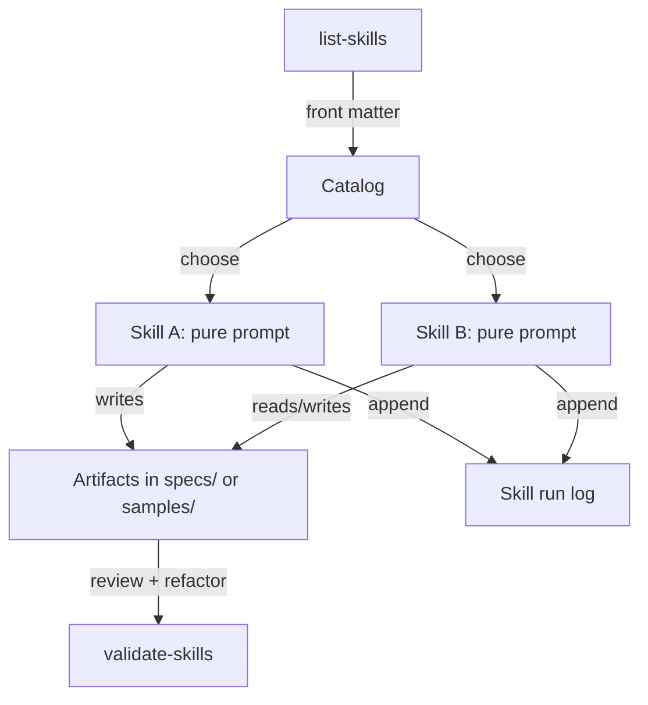

# Functional Skill Architecture

This guide explains how to design and operate the Claude Skills catalog using a functional-programming mindset. Treat each skill as a pure, composable function with explicit inputs and outputs so local IDE agents and cloud agents can orchestrate them predictably.

## Principles
- **Pure inputs/outputs:** Skills declare variables up front and write results to deterministic artifact paths (specs, samples, or runbooks). Avoid implicit context.
- **Composition over mutation:** Chain skills by feeding one skill's outputs (files, SDD sections, tables) as inputs to the next. Prefer small, single-purpose skills.
- **Idempotence:** Re-running a skill should converge on the same artifact. Store timestamps in logs (not in primary deliverables) to preserve diffable outputs.
- **Progressive disclosure:** Enumerate skills with `scripts/list-skills` and load bodies lazily (Codex/IDE agents should read SKILL.md only when relevant).
- **Cross-agent portability:** Keep skill contracts tool-agnostic. When integrating APIs, MCP servers, or scripts, specify them in **Toolchain & Integrations** and ensure fallbacks exist.

## Architecture Sketch

## Implementation Patterns
- **Skill factories:** Author new skills by copying a minimal template and filling only the variables, outputs, and Toolchain sections. Avoid copy/paste of body prose between skills.
- **Composable scripts:** Keep `scripts/list-skills` and `scripts/validate-skills` side-effect free so they can be piped or called from MCP servers.
- **Declarative samples:** Seed `samples/` with functional traces (inputs → outputs) instead of long-form narratives. Each sample should prove the skill contract is real.
- **Logs as data:** Append to `samples/whatsup-logistics/skill-run-log.json` (or project-specific logs) using JSON lines so downstream automations can diff and replay runs.

## How to adopt
1. **Design** a skill as a pure function (inputs, outputs, assumptions). Place it under the appropriate phase folder so validation passes.
2. **Wire** explicit tool calls in **Toolchain & Integrations**. Prefer short, composable scripts over monoliths.
3. **Test** with `scripts/validate-skills` and a quick dry run inside `samples/` before merging.
4. **Publish** via MCP (`mcp/servers/skills_catalog`) or the web app so IDE and cloud agents share the same catalog.
5. **Evolve** skills like code: branch, PR, validate, and record run logs to keep the source of truth reproducible.
